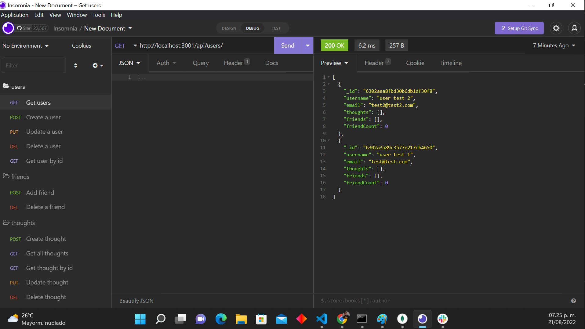
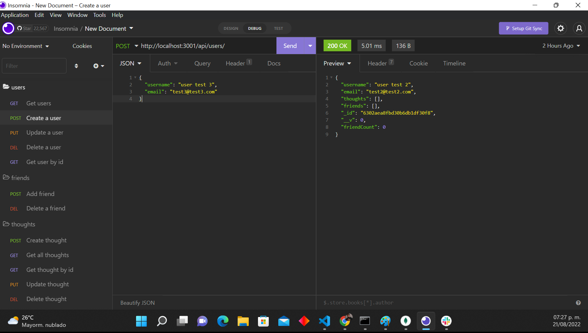
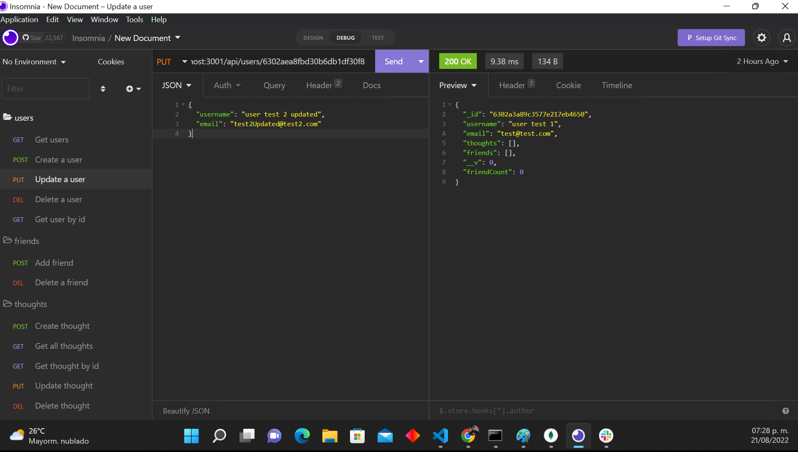
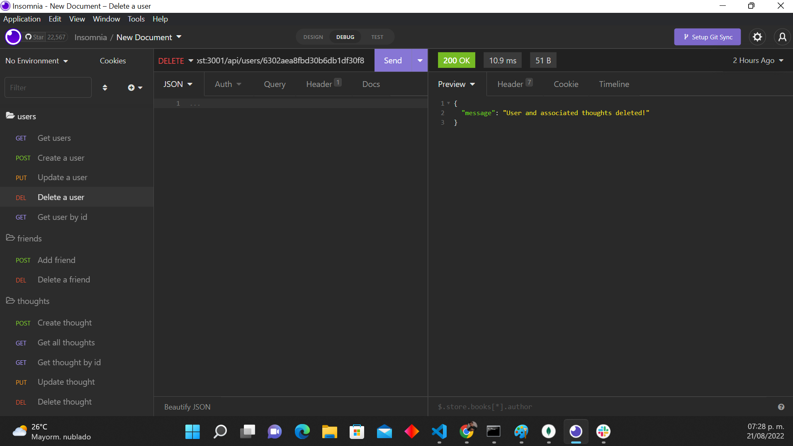
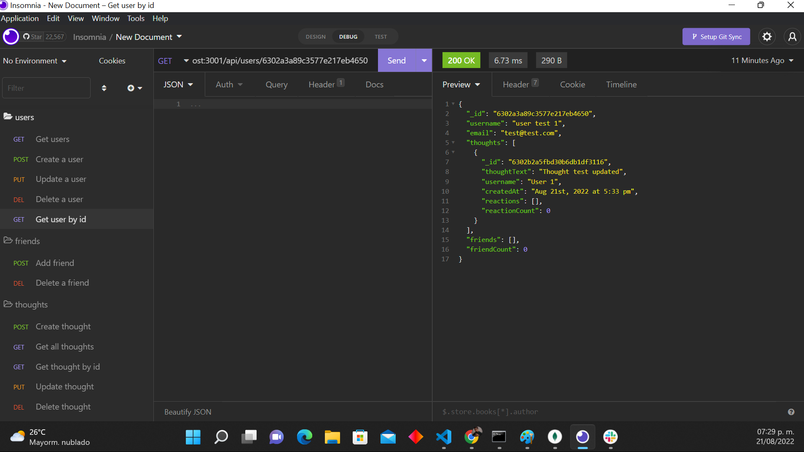

# NoSQL-Social-Network-API

[](https://github.com/israel2800)
[](https://github.com/israel2800/NoSQL-Social-Network-API)
[](https://github.com/israel2800/NoSQL-Social-Network-API)
[](https://nodejs.org/en/)
[](https://www.npmjs.com/package/inquirer)
[](https://choosealicense.com/licenses/mit/)

## Table of Content
* [ Project Links ](#Project-Links)
* [ Screenshots-Demo ](#Screenshots)
* [ Project Objective ](#Project-Objective)
* [ User Story ](#User-Story)
* [ Technologies ](#Technologies)
* [ Installation ](#Installation)
* [ Usage ](#Usage)
* [ Credits and Reference ](#Credits-and-Reference)
* [ Tests ](#Tests)
* [ Author Contact ](#Author-Contact)
* [ License ](#License)
#

##  Project Links

Walkthrough Video:
https://youtu.be/pQNc4nTKdWA

GitHub project:
https://github.com/Israel2800/NoSQL-Social-Network-API

## Screenshots-Demo

**Insomnia GET Test:**



**Insomnia POST Test:**



**Insomnia PUT Test:**



**Insomnia DELETE Test:**



**Insomnia GET a user by id Test:**



## Project Objective
To create a Social Network API using a NoSQL database, so that the website will handle large amounts of unstructured data; we will be able to add, update, delete and view specific information using the POST, PUT, DELETE AND GET methods. The specific information that we will be manipulating will be a user, a friend for a user, a thought for a user, a reaction for a thought. Also whenever we delete a user, their associated thoughts will do as well! 

## User Story
AS A social media startup, I WANT an API for my social network that uses a NoSQL database, SO THAT my website can handle large amounts of unstructured data.

## Technologies 
```
Node.js, JavaScript, Express, MongoDB, Mongoose
```

## Installation
You will need to have installed MongoDB, [click here](https://www.mongodb.com/docs/manual/tutorial/install-mongodb-on-windows/) for a quick guide to install MongoDB.
Access to the GitHub project and clone or download the project, you can do this by clicking in the green button with the word "Code". If you decided to clone the repo you need to choose one of the SSH/HTTPS keys and copy one, after this you will need to open the terminal of your choice and type "git clone 'key'" you will need to paste one of the two keys you previously select and then click enter. If you decided to download the project you will click in the "Download.zip" option and the project will be downloaded so you will locate the file and do a right-click to select "Extract All" and you can choose where tu place it.

## Usage 
To use this app you will need to download and install the Terminal for Mac or GitBash for Windows. You may also need to install [node.js](https://nodejs.org/en/), [npm](https://www.npmjs.com/), [MongoDB](https://www.mongodb.com/docs/manual/tutorial/install-mongodb-on-windows/) and [insomnia](https://insomnia.rest/download) to test the project. You will open the project in the code editor of your choice and then open the terminal and type "npm install" or "npm i" to install all the dependencies required. After installing MongoDB, on your terminal or GitBash you will need to type "mongod" to start the server, this will allow a successfully connection with the project. Finally you will be able to start the project typing "npm start" on your terminal or GitBash. And that is it, now you are able to test the code with insomnia!

## Credits and Reference
The following links helped me with the project: [Mongoose](https://www.npmjs.com/package/mongoose) and [Express](https://www.npmjs.com/package/express).

## Tests
npm test

## Author Contact
Contact the author with any questions!<br>
Github link: [Israel2800](https://github.com/israel2800)<br>
Email: dady281100@gmail.com

## License
This project is [MIT](https://choosealicense.com/licenses/mit/) licensed.<br />

Copyright © 2022 [ISRAEL AGUILAR](https://github.com/israel2800)

<hr>
<p align='center'><i>
This README was generated with ❤️ by ISRAEL AGUILAR
</i></p>
